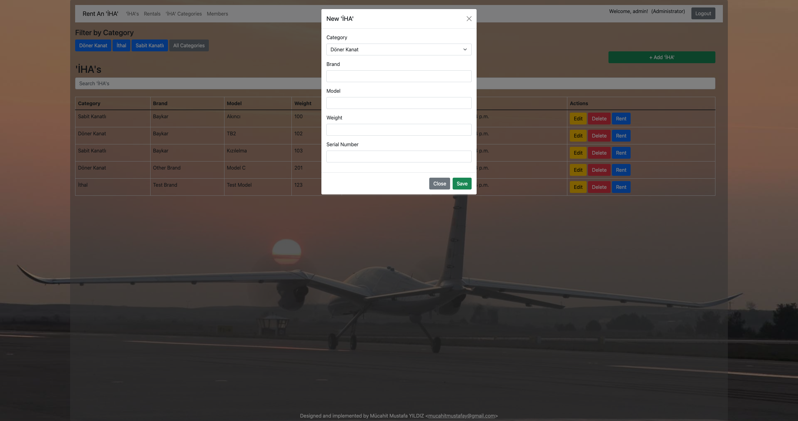

# Rent An IHA

## Notes

1. Test cases are written only for the login page.
2. Server-side datatable is used only in the category filtering section on the İHAs page.

## Requirements

1. Docker
2. Docker Compose
3. Python 3.8
4. Package requirements are in the requirements.txt file

## To run the project with docker

1. Clone the repository
2. Run the following command in the root directory of the project

```bash
docker-compose up
```

3. The project will be running on http://localhost:8000
4. To stop the project run the following command

```bash
docker-compose down
```

5. The default superuser is `admin` and the password is `Admin123`

## To run the project without docker

1. Clone the repository
2. Run the following command in the root directory of the project

```bash
pip install -r requirements.txt
```

3. Run the fallowing command to create the database

```bash
python manage.py migrate
```

4. Run the following command to create a superuser

```bash
python manage.py createsuperuser
```

5. Run the following command in the root directory of the project

```bash
python manage.py runserver
```

6. The project will be running on http://localhost:8000
7. To stop the project press `Ctrl + C`
8. To run the tests run the following command in the root directory of the project

```bash
python manage.py test
```

## Screenshots

### Login Page


### Sign up Page


### İHAs Page for Users


### İHAs Page for Administrators


## Add İHA Page for Administrators


## Rentals Page for Users


## Rentals Page for Administrators


## Members Page for Administrators


## Admin Panel
_Go to the http://localhost:8000/admin page to access the admin panel._


