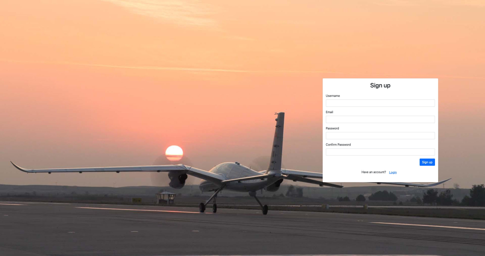
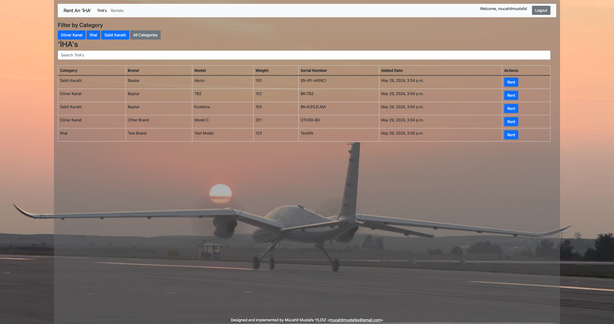
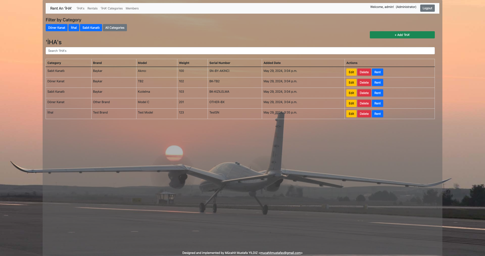
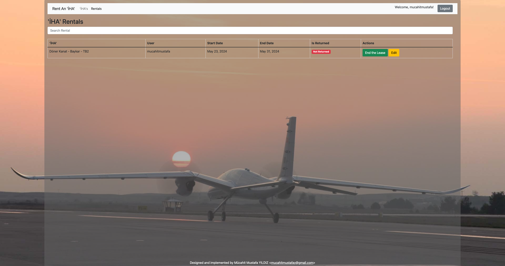
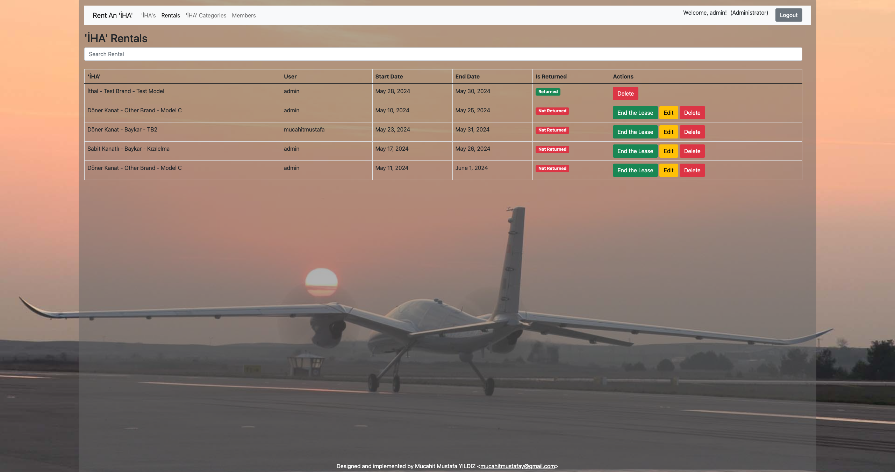
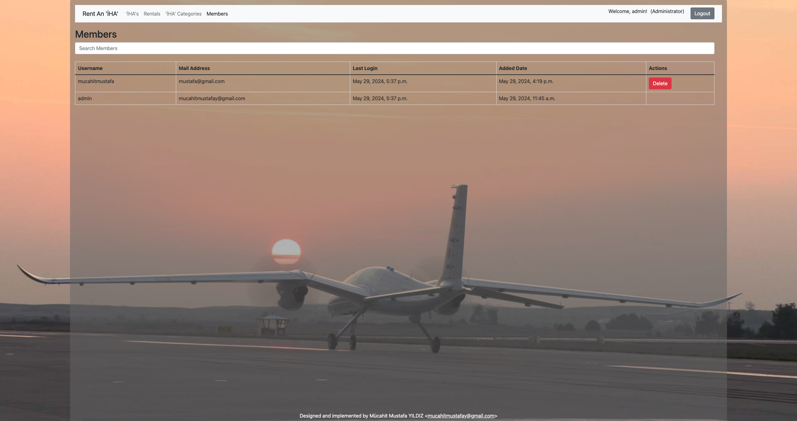
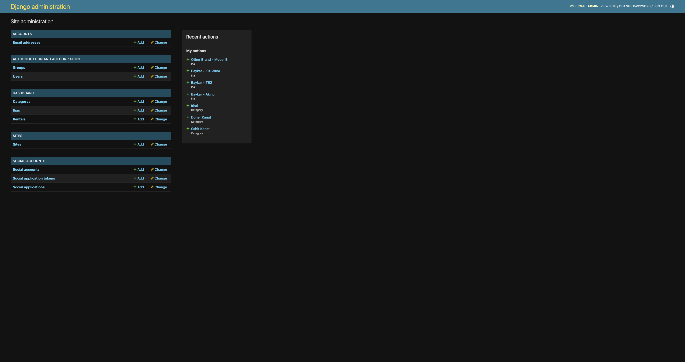

# Rent An IHA

## To run the project with docker

1. Clone the repository
2. Run the following command in the root directory of the project
```bash
docker-compose up
```
3. The project will be running on http://localhost:8000
4. To stop the project run the following command
```bash
docker-compose down
```
5. The default superuser is `admin` and the password is `Admin123`

## To run the project without docker
1. Clone the repository
2. Run the following command in the root directory of the project
```bash
pip install -r requirements.txt
```
3. Run the fallowing command to create the database
```bash
python manage.py migrate
```
4. Run the following command to create a superuser
```bash
python manage.py createsuperuser
```
5. Run the following command in the root directory of the project
```bash
python manage.py runserver
```
6. The project will be running on http://localhost:8000
7. To stop the project press `Ctrl + C`
8. To run the tests run the following command in the root directory of the project
```bash
python manage.py test
```

## Screenshots
### Login Page

### Sign up Page

### İHAs Page for Users

### İHAs Page for Administators

## Rentals Page for Users

## Rentals Page for Administators

## Members Page for Administators

## Admin Panel

